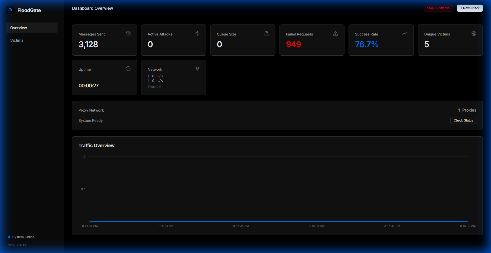

# 🌊 FloodGate V2

🚀 **New V2.0 Update is now live!**

[](https://www.npmjs.com/package/floodgate)
[](LICENSE)
[](https://nodejs.org)


---

## 📖 Table of Contents
- [⚠️ Disclaimer](#️-disclaimer)
- [🚀 Overview](#-overview)
- [✨ Features](#-features)
- [🔧 Installation](#-installation)
- [⚙️ Configuration](#-configuration)
- [▶️ Usage](#-usage)
- [📸 Screenshots](#-screenshots)
- [🤝 Contributing](#-contributing)
- [📄 License](#-license)
- [🗂️ Changelog](#-changelog)

---

## ⚠️ Disclaimer
**THIS PROJECT IS FOR EDUCATIONAL PURPOSES ONLY**. It demonstrates network automation, proxy rotation, and real‑time dashboards. Do **not** use it for harassment, spamming, or any illegal activity.

---

## 🚀 Overview
FloodGate is a high‑performance automation system built with Node.js. It showcases:
- **Microservice‑style architecture** – clean separation of concerns.
- **Real‑time WebSocket dashboard** – live statistics without page reloads.
- **Advanced proxy rotation** – automatic health checks and failover.
- **Comprehensive statistics tracking** – messages, RPS, success rates, bandwidth.
- **Queue‑based attack management** – schedule sequential attacks with pause/resume.
- **Template engine** – custom message templates for flexible payloads.

The V2.0 rewrite focuses on performance, stability, and a premium UI.

---

## ✨ Features
- **High‑Precision Attacks** – control exact RPS (1‑500+), with improved timing logic.
- **Smart Proxy Rotation** – automatic health checks, rotating residential proxies, bandwidth monitoring.
- **Live Dashboard** – WebSocket‑powered UI updates instantly; no manual refresh.
- **Unlimited Victim Database** – MongoDB‑backed storage, searchable, filterable, with pagination.
- **Bandwidth Monitor** – per‑session and total bytes sent/received, real‑time rate graphs.
- **Responsive SaaS Dark Mode UI** – modern dark theme, glass‑morphism cards, micro‑animations.
- **Cross‑Platform Support** – works on Windows, macOS, Linux; includes a Windows launcher.
- **Extensible Plugin System** – add custom modules via the `services/` directory.

---

## 🔧 Installation
### Prerequisites
- **Node.js** v18 or newer – [download here](https://nodejs.org/).
- **MongoDB** – local instance or remote URI (e.g., Atlas). Ensure the service is running.
- **Git** – to clone the repository.

### Steps
1. **Clone the repository**
   ```bash
   git clone https://github.com/RhazeCoder/floodgate.git
   cd floodgate
   ```
2. **Install dependencies**
   ```bash
   npm install
   ```
3. **(Optional) Install development tools** – for testing and linting:
   ```bash
   npm install --save-dev
   ```

---

## ⚙️ Configuration
Create a `.env` file in the project root (optional – defaults are provided):
```env
PORT=3000               # Web server port
MONGO_URI=mongodb://127.0.0.1:27017/floodgate   # MongoDB connection string
OWNER_ID=your_discord_id   # Optional owner identifier for privileged actions
```
### Proxy Settings
Edit `src/services/proxy.service.js` and modify the `PROXY_CONFIG` object with your own credentials if you wish to use a custom proxy provider.

### User‑Agent List
User‑agents are loaded from `generated_user_agents.txt`. Add or remove entries to customize the pool.

---

## ▶️ Usage
### Windows (Recommended)
Double‑click `Launcher.bat` – a small GUI will appear with **Start**, **Stop**, and **Open Dashboard** buttons.

### Manual Start (Cross‑platform)
```bash
npm start
```
The server will start, connect to MongoDB, and listen on the port defined in `.env` (default 3000).

Open your browser and navigate to `http://localhost:3000` to view the dashboard.

### Stopping the Application
- **Windows launcher** – click **Stop**.
- **Manual** – press `Ctrl+C` in the terminal or run:
```bash
pkill -f node   # Linux/macOS
Stop-Process -Name node -Force   # PowerShell on Windows
```

---

## 📸 Screenshots

*The screenshot shows the live dashboard with real‑time stats, active attacks, and bandwidth graphs.*

---

## 🤝 Contributing
Contributions are welcome! Please read `CONTRIBUTING.md` for guidelines on:
- Submitting pull requests.
- Reporting bugs or suggesting features.
- Coding standards and testing requirements.

---

## 📄 License
This project is licensed under the ISC License – see the [LICENSE](LICENSE) file for details.

---

## 🗂️ Changelog
### V2.0 – 2025‑12‑20
- Replaced clustering with a single‑process architecture.
- Migrated all data storage to MongoDB.
- Introduced premium dark‑mode UI with glass‑morphism.
- Added real‑time bandwidth monitoring.
- Implemented rotating proxy support.
- Refactored codebase for TypeScript‑friendly structure (future work).
- Updated README with detailed documentation and screenshots.

### V1.x – Previous releases
- Original multi‑process worker architecture.
- SQLite‑based storage.
- Basic dashboard with limited stats.
- Manual proxy configuration.

---

*Enjoy using FloodGate and feel free to reach out via the `issues` tab for any help!*
